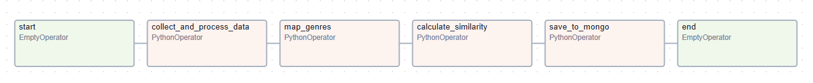

# 🎞️ Airflow

## 파일 구성
```
├── airflow-compose.yml         # docker compose file
├── config
├── dags
│   ├── py                      # DAG에서 사용되는 python모듈들
│   │   ├── __init__.py
│   │   ├── calculate.py        # 유사도 계산 모듈
│   │   └── processing.py       # 데이터 전처리 모듈
│   └── similarity.py           # Airflow 내에서 실행되는 DAG 파일
└── requirements.txt
```

## 실행 방법
```
docker compose -f airflow-compose.yml up --build -d
docker compose -f airflow-compose.yml down
```


## DAG

| **Task**                     | **Description** |
|------------------------------|-----------------|
| collect_and_process_data | 데이터베이스에서 각 사용자가 좋아하는 영화 목록을 가져와, 각 영화의 장르, 감독, 배우 정보 추출 후 전처리 수행              |
| map_genres               | int 형식의 장르 id를 실제 장르 이름으로 매핑                |
| calculate_similarity     | 사용자별 장르 선호도에 대한 코사인 유사도 계산, 영화 제목, 감독, 배우에 대해서는 자카드 유사도 계산 수행                 |
| save_to_mongo            | 계산한 유사도를 JSON 형식으로 데이터베이스에 저장                |

